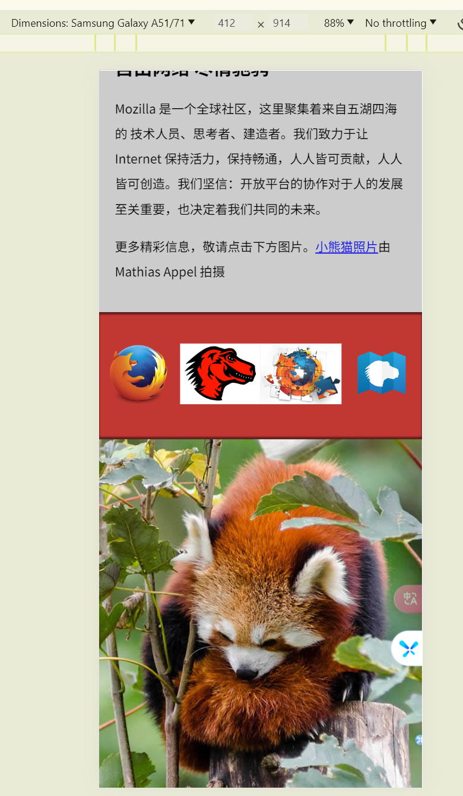

## 概述

> 本文。

<!--more-->

## 正文

### 练习二: 构建网页内容  
> https://developer.mozilla.org/zh-CN/docs/Learn/HTML/Introduction_to_HTML/Structuring_a_page_of_content

### 练习三: Mozilla 
> https://developer.mozilla.org/zh-CN/docs/Learn/HTML/Multimedia_and_embedding/Mozilla_splash_page  
- 为 header 添加一个图标  
- 为主 article 添加一个视频  
- 为 further info 的链接添加响应式图片  
- 一张小熊猫的艺术照  

 

