## 概述

> excle使用技巧

<!--more-->

## vlookup常见使用方法  

### 1.vlookup简单匹配

`=IFERROR(VLOOKUP(H4,$A$1:$E$31,3,0),"")` 

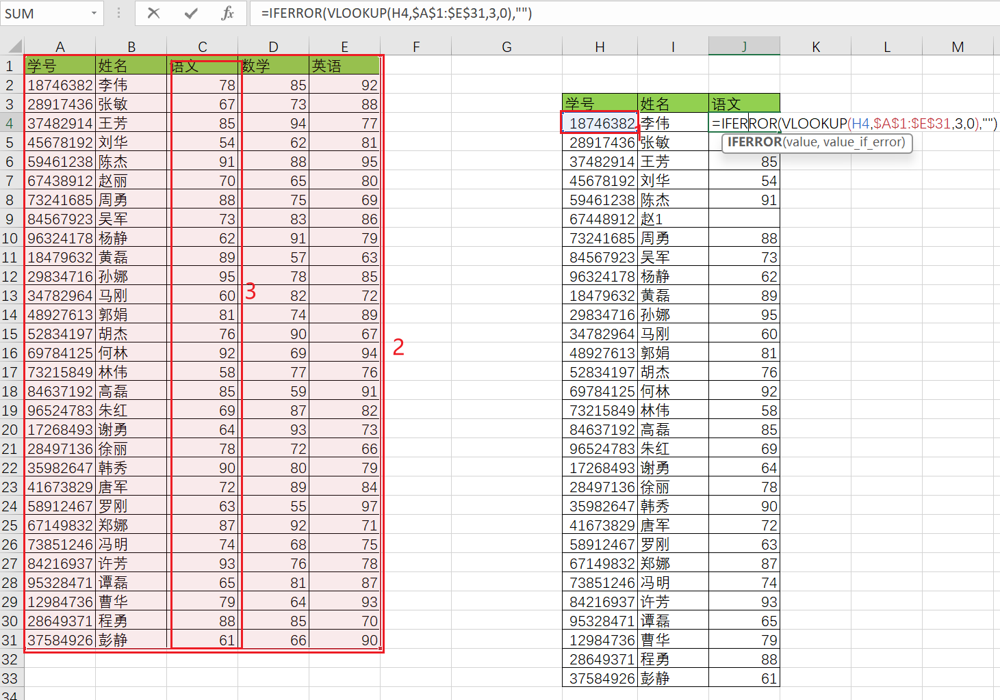

H4:要通过H4匹配
$A$1:$E$31:匹配值所在的区域范围,做绝对匹配
3:要返回的数据在匹配内容中所处的位置
0:精确匹配
"":匹配不到时返回空

### 2.匹配返回多个值

**列锁定行不锁定**  
`=VLOOKUP($H8,$A$1:$E$31,COLUMN(B1),0)`

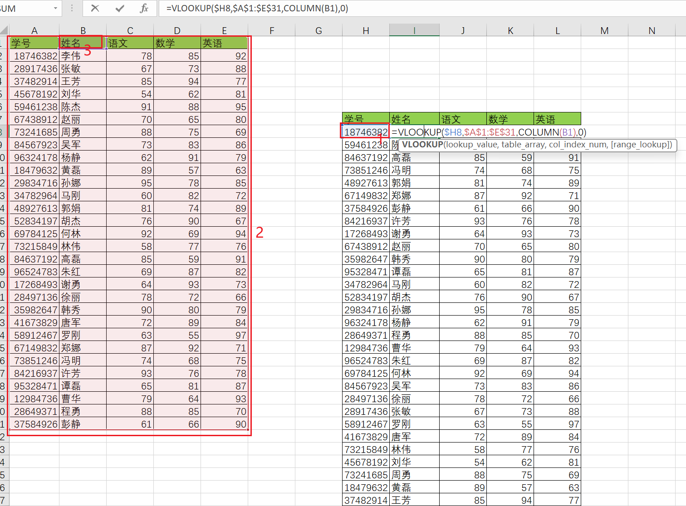

### 3.关键字查找

`=VLOOKUP("*"&U6&"*",$P$2:$S$32,2,0)`
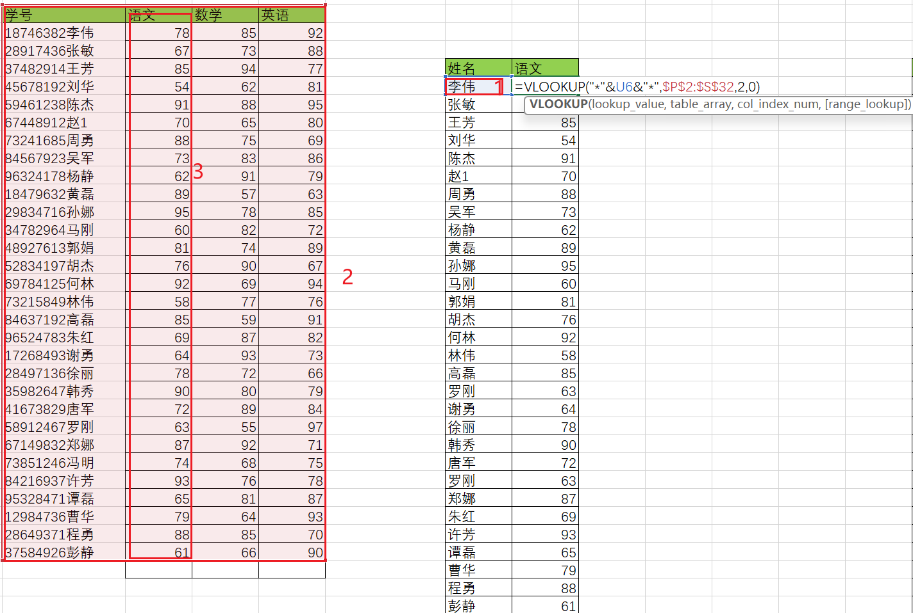

```text
"*"&U6&"*":要通过R6关键字匹配
$P$2:$S$32:匹配值所在的区域范围,做绝对匹配
2:要返回的数据在匹配内容中所处的位置
0:精确匹配
```

### 4.文本数值混合查找

- 将U6转为文本型的数据  
`=VLOOKUP(U6&"",$B$1:$E$31,3,0)`

- 将U6转为数值型的数据  
`=VLOOKUP(U6*1,$B$1:$E$31,3,0)` 


### 5.去除空格查找

- U6中有空格,U6中的空格删掉匹配    
`=VLOOKUP(SUBSTITUTE(U6," ",""),$B$1:$E$31,3,0)` 

- 查找区域内有空格
`=VLOOKUP(U6,SUBSTITUTE($B$1:$E$31," ",""),3,0)`  

### 6.去除不可见字符查找

`=VLOOKUP(CLEAN(U6),CLEAN($B$1:$E$31),3,0)`


### 7.多列动态查询
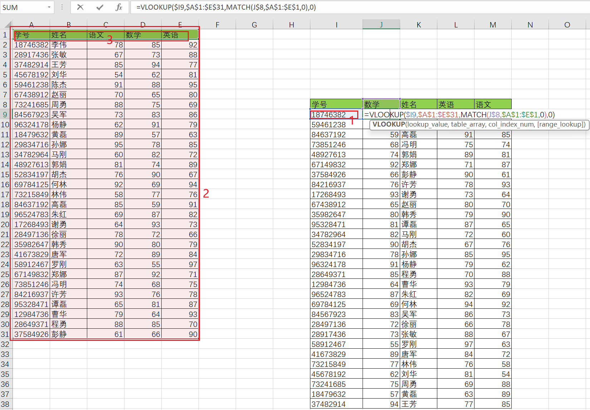

`=VLOOKUP($I9,$A$1:$E$31,MATCH(J$8,$A$1:$E$1,0),0)`  
- $I9:列锁定  
- MATCH:多列动态查询 J$8: 锁定查询范围(锁定第8行)  


### 8.一对多查找
`=COUNTIF($B$8:B8,B8)`

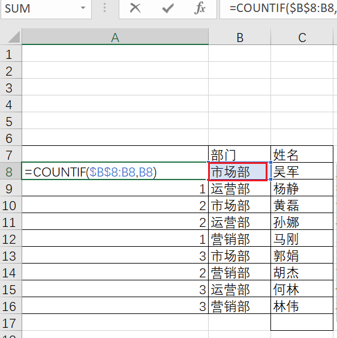

`=B8&COUNTIF($B$8:B8,B8)`

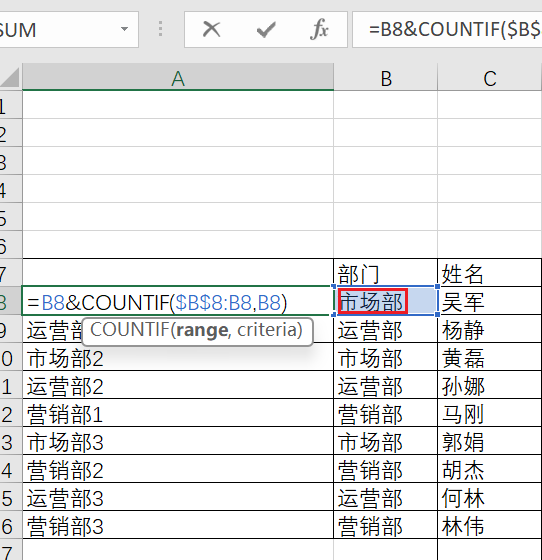

`=VLOOKUP($F8&COLUMN(A1),$A$7:$C$16,3,0)` 

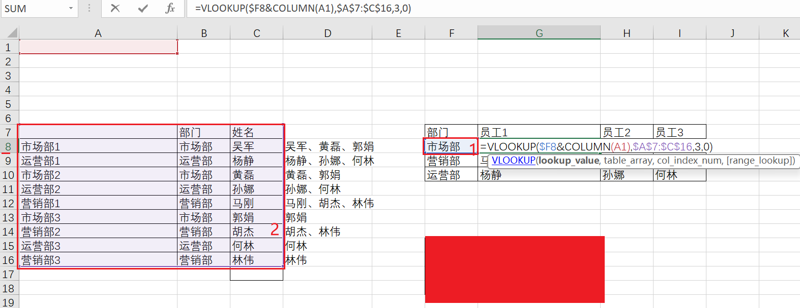


### 9.查找组合  

`=C8&IFERROR("、"&VLOOKUP(B8,B9:D17,3,0),"")`

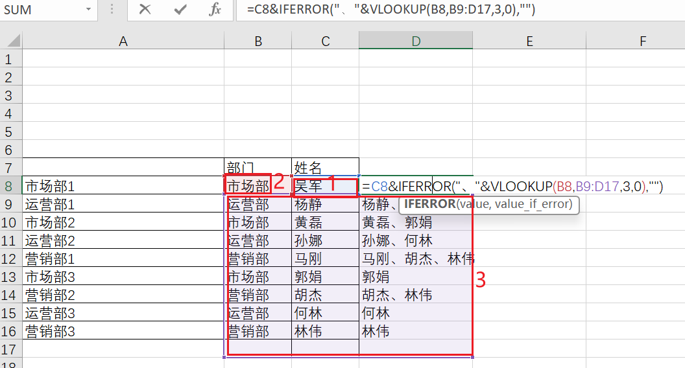

### 10.多区域混合查找

`=VLOOKUP(B8,IF(F21="是",$A$24:$C$34,$A$36:$C$48),2,0)`  

### 11.跨多表查询indirect
`=VLOOKUP($A4,INDIRECT("表"&COLUMN(A1)&"!$A$2:$D$6"),4,0)`  

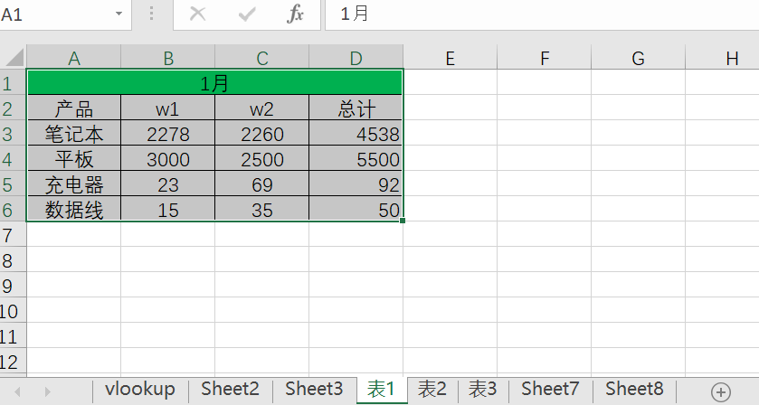  
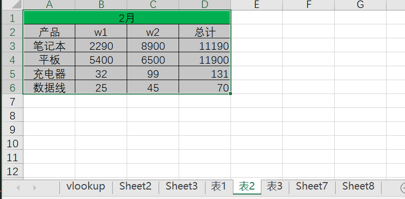
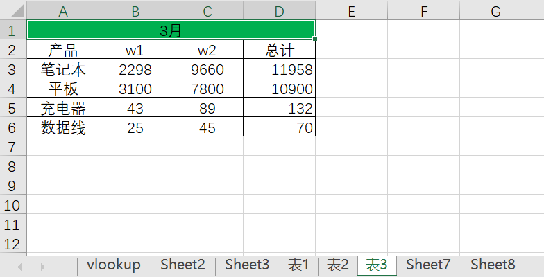
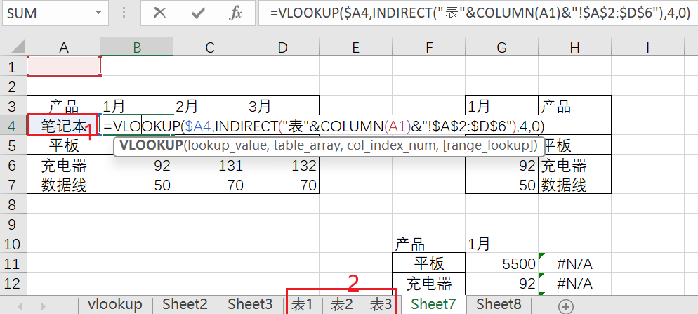


### 12.反向查找（数组）

`=VLOOKUP(G4,IF({1,0},$B$4:$B$7,$A$4:$A$7),2,0)`  

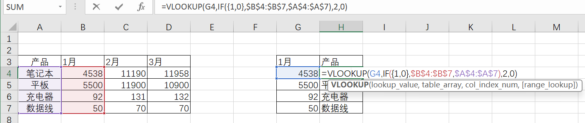

### 13.多条件查找

`=VLOOKUP(F11&G11,IF({1,0},$B$4:$B$7&$A$4:$A$7,$D$4:$D$7&$A$4:$A$7),4,0)`  
