## GO学习

> go环境准备。 
> https://youdianzhishi.com/web/course/1049/3235  

<!--more-->

## 正文

### windows环境安装golang    
1. 下载安装包: https://go.dev/dl/go1.22.2.windows-amd64.msi
2. 安装go1.22.2.windows-amd64.msi 
3. 配置GOROOT和GOPATH环境变量  
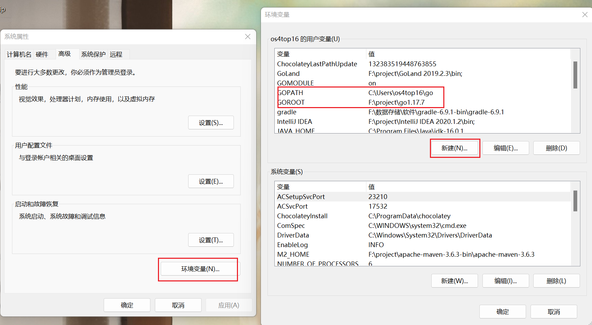
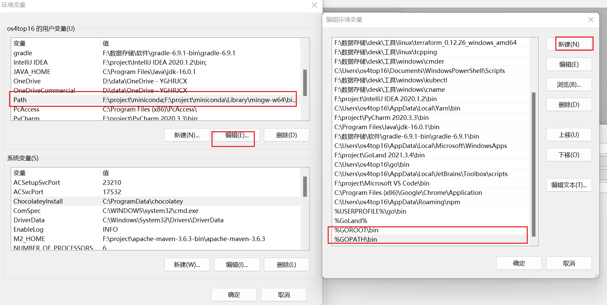
4. 配置go代理  
在cmd/powershell/git-bash执行下面的命令
```
go env -w GO111MODULE=on
go env -w GOPROXY=https://goproxy.cn,direct
```

### linux环境安装golang  
```bash
wget https://go.dev/dl/go1.22.2.linux-amd64.tar.gz
tar zxvf goxxx.tar.gz –C /usr/local
#在~/.bashrc文件中添加下面的内容
export GOROOT=/usr/local/go
export GOPATH=/data/go_path
export PATH=$PATH:$GOROOT/bin: :$GOPATH/bin
```
### vscode配置go开发环境  
#### 安装go插件
#### 安装go扩展依赖工具  
1. 打开命令面板: Shift + Ctrl + P
2. 输入: Install/Update 搜索 Go扩展依赖工具安装命令 
3. 安装失败后,执行下面的命令进行安装  
```bash
go install -v golang.org/x/tools/gopls@latest
go install -v honnef.co/go/tools/cmd/staticcheck@latest
go install -v github.com/go-delve/delve/cmd/dlv@latest
go install -v github.com/haya14busa/goplay/cmd/goplay@latest
go install -v github.com/josharian/impl@latest
go install -v github.com/fatih/gomodifytags@latest
go install -v github.com/cweill/gotests/gotests@latest
go install -v github.com/ramya-rao-a/go-outline@latest
go install -v github.com/uudashr/gopkgs/v2/cmd/gopkgs@latest
```

#### 配置shell环境  
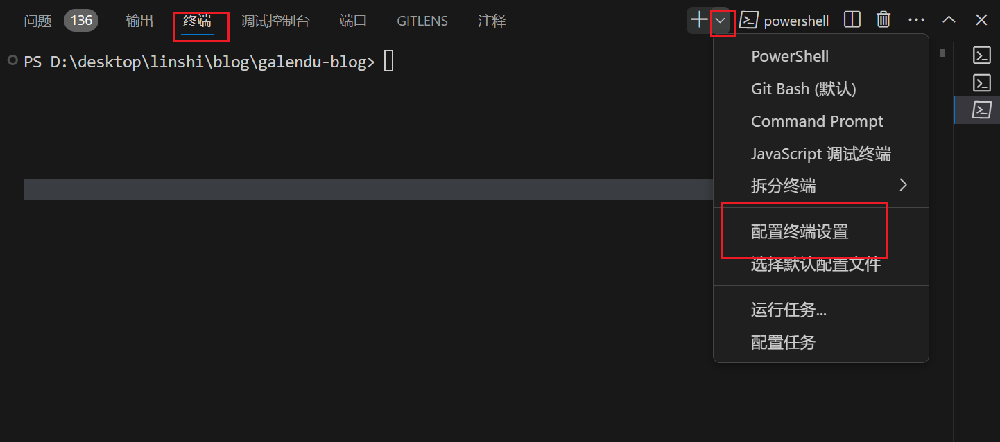

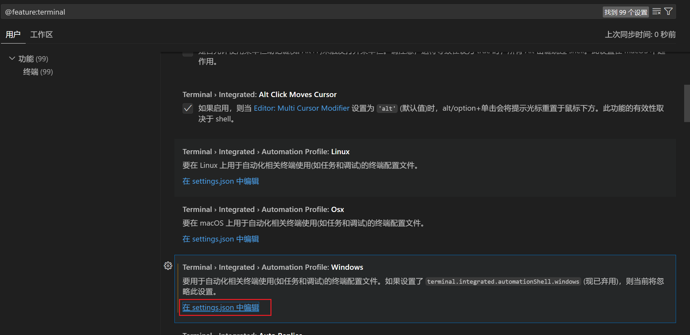

在settings.json文件大括号中添加下面的内容
```json
    "terminal.integrated.automationProfile.windows": {
        "C:\\Program Files\\Git\\bin\\bash.exe"
    },
    "terminal.integrated.defaultProfile.windows": "Git Bash"
```
重启vscode, 可以看到默认打开Git Bash终端、也可选择其他终端
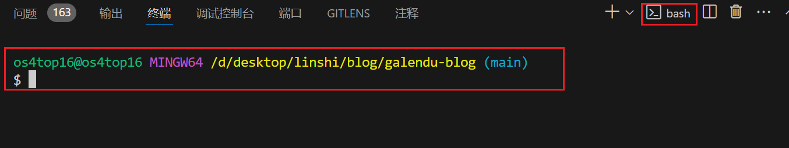

### goland破解之2019.2.3   

将解压包中的jar包复制到F:\project\GoLand 2019.2.3\lib目录
在 Goland 安装目录的 bin 目录下找到goland.exe.vmoptions和goland64.exe.vmoptions两个文件。用记事本将它们打开，并分别在两个文件的最后面追加-javaagent:Goland 的安装目录\lib\jetbrains-agent.jar，注意将路径修改成你电脑上 Goland 的安装目录，例如：-javaagent:F:\project\GoLand 2019.2.3\lib\jetbrains-agent.jar，修改完成后记得保存。

运行Goland进入激活界面，选择Active，选择激活码激活，将解压的激活码打开复制到文本框中，然后OK即可。


### go安装常见问题  
>goland中使用高版本的go时出现高版本无法识别的问题,报错"The selected directory is not a valid home for Go Sdk"

zversion.go中添加要使用的sdk版本const TheVersion = `go1.22.2`

### goland破解之2024.2.3  
- [下载jetbra.zip包](https://galendu.github.io/file/jetbra.zip)  

- 安装最新版2024.2.3的goland    
https://www.jetbrains.com/go/

- 破解  
1. 文件路径如图所示  
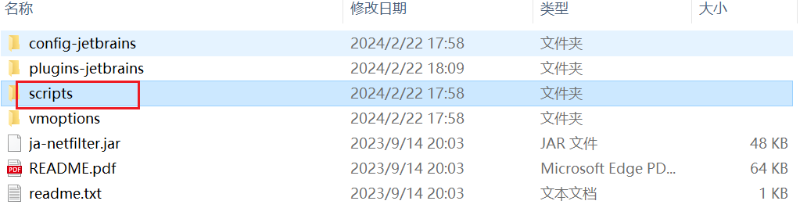  
2. 卸载，防止历史运行过该脚本文件  
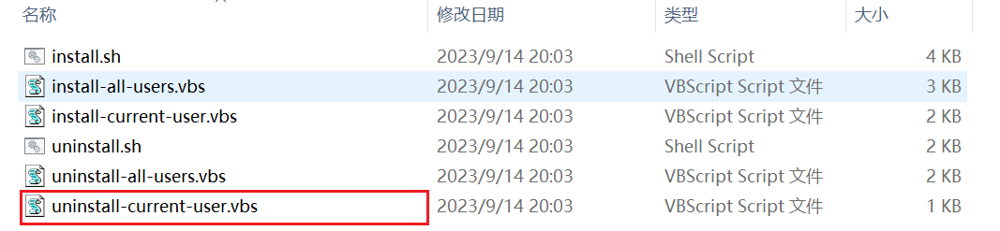
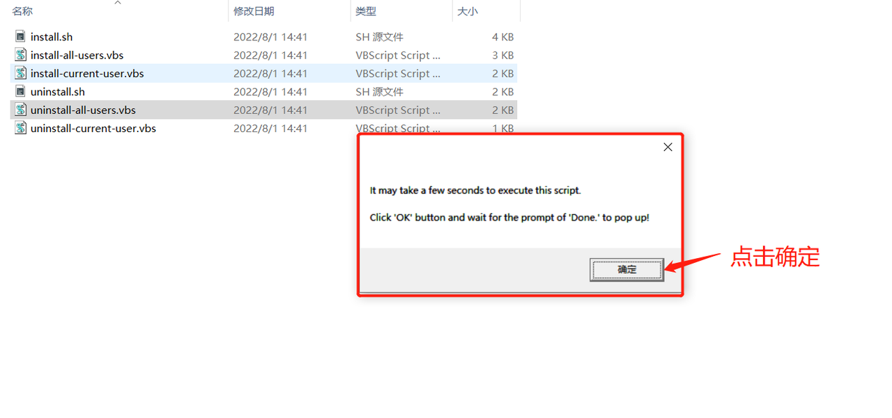
3. 安装
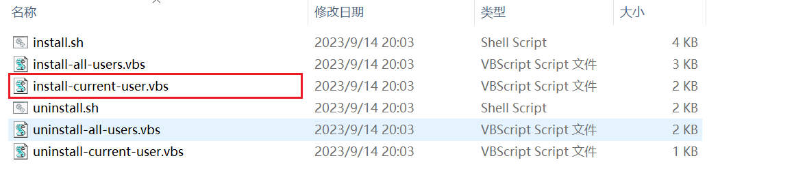
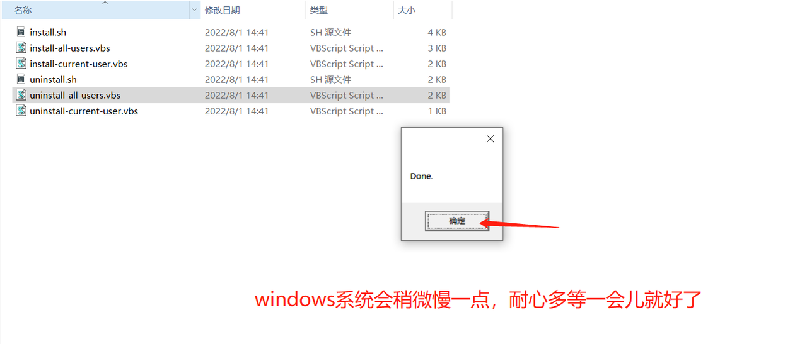
4. 输入license 
```txt
X9MQ8M5LBM-eyJsaWNlbnNlSWQiOiJYOU1ROE01TEJNIiwibGljZW5zZWVOYW1lIjoiZ3VyZ2xlcyB0dW1ibGVzIiwiYXNzaWduZWVOYW1lIjoiIiwiYXNzaWduZWVFbWFpbCI6IiIsImxpY2Vuc2VSZXN0cmljdGlvbiI6IiIsImNoZWNrQ29uY3VycmVudFVzZSI6ZmFsc2UsInByb2R1Y3RzIjpbeyJjb2RlIjoiSUkiLCJmYWxsYmFja0RhdGUiOiIyMDI2LTA5LTE0IiwicGFpZFVwVG8iOiIyMDI2LTA5LTE0IiwiZXh0ZW5kZWQiOmZhbHNlfSx7ImNvZGUiOiJBQyIsImZhbGxiYWNrRGF0ZSI6IjIwMjYtMDktMTQiLCJwYWlkVXBUbyI6IjIwMjYtMDktMTQiLCJleHRlbmRlZCI6ZmFsc2V9LHsiY29kZSI6IlBTIiwiZmFsbGJhY2tEYXRlIjoiMjAyNi0wOS0xNCIsInBhaWRVcFRvIjoiMjAyNi0wOS0xNCIsImV4dGVuZGVkIjpmYWxzZX0seyJjb2RlIjoiRFBOIiwiZmFsbGJhY2tEYXRlIjoiMjAyNi0wOS0xNCIsInBhaWRVcFRvIjoiMjAyNi0wOS0xNCIsImV4dGVuZGVkIjpmYWxzZX0seyJjb2RlIjoiR08iLCJmYWxsYmFja0RhdGUiOiIyMDI2LTA5LTE0IiwicGFpZFVwVG8iOiIyMDI2LTA5LTE0IiwiZXh0ZW5kZWQiOmZhbHNlfSx7ImNvZGUiOiJDTCIsImZhbGxiYWNrRGF0ZSI6IjIwMjYtMDktMTQiLCJwYWlkVXBUbyI6IjIwMjYtMDktMTQiLCJleHRlbmRlZCI6ZmFsc2V9LHsiY29kZSI6IkRNIiwiZmFsbGJhY2tEYXRlIjoiMjAyNi0wOS0xNCIsInBhaWRVcFRvIjoiMjAyNi0wOS0xNCIsImV4dGVuZGVkIjpmYWxzZX0seyJjb2RlIjoiUlMwIiwiZmFsbGJhY2tEYXRlIjoiMjAyNi0wOS0xNCIsInBhaWRVcFRvIjoiMjAyNi0wOS0xNCIsImV4dGVuZGVkIjpmYWxzZX0seyJjb2RlIjoiRFMiLCJmYWxsYmFja0RhdGUiOiIyMDI2LTA5LTE0IiwicGFpZFVwVG8iOiIyMDI2LTA5LTE0IiwiZXh0ZW5kZWQiOmZhbHNlfSx7ImNvZGUiOiJSQyIsImZhbGxiYWNrRGF0ZSI6IjIwMjYtMDktMTQiLCJwYWlkVXBUbyI6IjIwMjYtMDktMTQiLCJleHRlbmRlZCI6ZmFsc2V9LHsiY29kZSI6IlJEIiwiZmFsbGJhY2tEYXRlIjoiMjAyNi0wOS0xNCIsInBhaWRVcFRvIjoiMjAyNi0wOS0xNCIsImV4dGVuZGVkIjpmYWxzZX0seyJjb2RlIjoiUEMiLCJmYWxsYmFja0RhdGUiOiIyMDI2LTA5LTE0IiwicGFpZFVwVG8iOiIyMDI2LTA5LTE0IiwiZXh0ZW5kZWQiOmZhbHNlfSx7ImNvZGUiOiJSU1UiLCJmYWxsYmFja0RhdGUiOiIyMDI2LTA5LTE0IiwicGFpZFVwVG8iOiIyMDI2LTA5LTE0IiwiZXh0ZW5kZWQiOmZhbHNlfSx7ImNvZGUiOiJSTSIsImZhbGxiYWNrRGF0ZSI6IjIwMjYtMDktMTQiLCJwYWlkVXBUbyI6IjIwMjYtMDktMTQiLCJleHRlbmRlZCI6ZmFsc2V9LHsiY29kZSI6IldTIiwiZmFsbGJhY2tEYXRlIjoiMjAyNi0wOS0xNCIsInBhaWRVcFRvIjoiMjAyNi0wOS0xNCIsImV4dGVuZGVkIjpmYWxzZX0seyJjb2RlIjoiREIiLCJmYWxsYmFja0RhdGUiOiIyMDI2LTA5LTE0IiwicGFpZFVwVG8iOiIyMDI2LTA5LTE0IiwiZXh0ZW5kZWQiOmZhbHNlfSx7ImNvZGUiOiJEQyIsImZhbGxiYWNrRGF0ZSI6IjIwMjYtMDktMTQiLCJwYWlkVXBUbyI6IjIwMjYtMDktMTQiLCJleHRlbmRlZCI6ZmFsc2V9LHsiY29kZSI6IlJTViIsImZhbGxiYWNrRGF0ZSI6IjIwMjYtMDktMTQiLCJwYWlkVXBUbyI6IjIwMjYtMDktMTQiLCJleHRlbmRlZCI6dHJ1ZX0seyJjb2RlIjoiUENXTVAiLCJmYWxsYmFja0RhdGUiOiIyMDI2LTA5LTE0IiwicGFpZFVwVG8iOiIyMDI2LTA5LTE0IiwiZXh0ZW5kZWQiOnRydWV9LHsiY29kZSI6IlBTSSIsImZhbGxiYWNrRGF0ZSI6IjIwMjYtMDktMTQiLCJwYWlkVXBUbyI6IjIwMjYtMDktMTQiLCJleHRlbmRlZCI6dHJ1ZX0seyJjb2RlIjoiUlNGIiwiZmFsbGJhY2tEYXRlIjoiMjAyNi0wOS0xNCIsInBhaWRVcFRvIjoiMjAyNi0wOS0xNCIsImV4dGVuZGVkIjp0cnVlfSx7ImNvZGUiOiJSU0MiLCJmYWxsYmFja0RhdGUiOiIyMDI2LTA5LTE0IiwicGFpZFVwVG8iOiIyMDI2LTA5LTE0IiwiZXh0ZW5kZWQiOnRydWV9LHsiY29kZSI6IlJTIiwiZmFsbGJhY2tEYXRlIjoiMjAyNi0wOS0xNCIsInBhaWRVcFRvIjoiMjAyNi0wOS0xNCIsImV4dGVuZGVkIjp0cnVlfSx7ImNvZGUiOiJQREIiLCJmYWxsYmFja0RhdGUiOiIyMDI2LTA5LTE0IiwicGFpZFVwVG8iOiIyMDI2LTA5LTE0IiwiZXh0ZW5kZWQiOnRydWV9LHsiY29kZSI6IkRQIiwiZmFsbGJhY2tEYXRlIjoiMjAyNi0wOS0xNCIsInBhaWRVcFRvIjoiMjAyNi0wOS0xNCIsImV4dGVuZGVkIjp0cnVlfV0sIm1ldGFkYXRhIjoiMDEyMDIzMTIwOUxQQUEwMDEwMDkiLCJoYXNoIjoiVFJJQUw6MjAxNi4xIiwiZ3JhY2VQZXJpb2REYXlzIjozLCJhdXRvUHJvbG9uZ2F0ZWQiOmZhbHNlLCJpc0F1dG9Qcm9sb25nYXRlZCI6ZmFsc2V9-YfGjX3wBpN0BKpIiuZdyG/NN4z8pLpOfzOjodnAqFomZafC0nTu5hRDMSkTB9Lrhfhl+5Mr8nC2BlFubcrLq3QzJRuAIinZ0DboIZhYLdnJhk3shg+qza6mnfUpwg0Cpq/TjlSO1Ov05JEBb6DeYqx4wBFeW0EbQcavJ8QiHMvrcQPkyD6oYvmU6QodraR9ILIYLKxKFra/Yg+tDWMoiTJ5sQ8DSzMsSrv4oCYvuP6Wu5qpQlxwY3sSy74BQ048PWJlnIoJNLnpd5x5A205Kze8tFyIu3Sm51KFZnC3GQUHlGloXwVHPI+ZHYghehPMcsCOpPlgOSRzFNw95gFzoYQ==-MIIETzCCAjegAwIBAgIEU7kY4jANBgkqhkiG9w0BAQsFADAYMRYwFAYDVQQDDA1KZXRQcm9maWxlIENBMB4XDTIyMTAxMDE2MDU0NFoXDTI0MTAxMTE2MDU0NFowHzEdMBsGA1UEAwwUcHJvZDJ5LWZyb20tMjAyMjEwMTAwggEiMA0GCSqGSIb3DQEBAQUAA4IBDwAwggEKAoIBAQCx0QBxb4pfhYqM/RjSsvizyIncjO1EwCRgxPbKCcRFSY3ANBzS3hUdBzIxNuVbEPlnw50ItAn1iUwlyQ3QC7T+aG9E2R3IIIfEppb4F2SBi3YtgcZc3IrLgz8wa2p0iWTkkbFwnJxD4jMBfw9HDDbS5r9d9HVcPDH0rA+4nNIm7yek0wU6D77KJUWcNm7QHJfLeJAoOno+G3UIsnu7f63XRGkvdxK7L/WFzD9hCfSwZqmPZkCcrDLJTBdU4UpoJrfIoSeXZ+ssrSdQ9qY0JfUmRWvJNuUKeDBv6TI3ZCipJeZzXXafE7xD3Q57YS6KlIJEUzjZ2CRJIK3Zu5aqUTHbAgMBAAGjgZkwgZYwSAYDVR0jBEEwP4AUo562SGdCEjZBvW3gubSgUouX8bOhHKQaMBgxFjAUBgNVBAMMDUpldFByb2ZpbGUgQ0GCCQDSbLGDsoN54TAJBgNVHRMEAjAAMBMGA1UdJQQMMAoGCCsGAQUFBwMBMAsGA1UdDwQEAwIFoDAdBgNVHQ4EFgQUQ0INJl2tuM1XlTAfueTuWydc7qIwDQYJKoZIhvcNAQELBQADggIBACzJFycVHjlSCEczoAHxgtF7NG4sDcpgmLh6nrMIZpDLLGc/whCv6vpcDkBo0XvuQwmZnbpf/Ndpy4ypP2OXIw94TlfOkGKVLdHDQU8ES1HpgAtscFtNg4dyZijF4pLgiK2nbCokvHI3oWQZY3ROswrjsh0HNHWdVKooEhWt3vBpXorusNRNWbwidznxySM5aABbHrlW0+EgXuLMEHBrybLu0QenEuTFZS3E91uSa7JLpU92aQyAmZUJAhogfIvssgwnmyfnOF3csixUV6lDBCf+SUGzQbYtZd/QsGI9uUUhBbLjoZnFhVEbbOntmB4/aUvSziZnbhRAY+OhVTrNX6GtXI03cAxVBk2Kh6DE62vBW3biBGHK5ClsQGW1f5RLWhqJh0d3EP6+dsAo2P3Ic5MCuspFwSfWoK3gNhvYlr57PNrzAWhBn6Od78RMaqg+dl+GHsm5sW5mbvXpvYNukEe1RHVIONl8OTKex1U12DeS4pAIA9aQxd1vYapmNdam3rnOQbynKLYa09aDPrWO5Y+LtaCix7TBmwXPtyCxBLK4S7EZ+FE7Xz322ulpKcvLZCTKBzUH5y62xHIcSijnxJfSU0W5UCApsnwochM5S6RPuVpvyQoBR5IX3Ugjw48jpuf2TGL/INWPHQ5AjK9ZNtWAfpkYc9w+AcNAa/v6J/Ha
```
**如果无效使用下面的-测试时间2025-01-03**  
```txt
YQLSN55KLT-eyJsaWNlbnNlSWQiOiJZUUxTTjU1S0xUIiwibGljZW5zZWVOYW1lIjoi5rC45LmF5Zyw5Z2AIHd3d8K3YWppaHVvwrdjb20iLCJsaWNlbnNlZVR5cGUiOiJQRVJTT05BTCIsImFzc2lnbmVlTmFtZSI6IiIsImFzc2lnbmVlRW1haWwiOiIiLCJsaWNlbnNlUmVzdHJpY3Rpb24iOiIiLCJjaGVja0NvbmN1cnJlbnRVc2UiOmZhbHNlLCJwcm9kdWN0cyI6W3siY29kZSI6IkdPIiwicGFpZFVwVG8iOiIyMDI1LTAxLTIyIiwiZXh0ZW5kZWQiOmZhbHNlfSx7ImNvZGUiOiJSUzAiLCJwYWlkVXBUbyI6IjIwMjUtMDEtMjIiLCJleHRlbmRlZCI6ZmFsc2V9LHsiY29kZSI6IkRNIiwicGFpZFVwVG8iOiIyMDI1LTAxLTIyIiwiZXh0ZW5kZWQiOmZhbHNlfSx7ImNvZGUiOiJDTCIsInBhaWRVcFRvIjoiMjAyNS0wMS0yMiIsImV4dGVuZGVkIjpmYWxzZX0seyJjb2RlIjoiUlNVIiwicGFpZFVwVG8iOiIyMDI1LTAxLTIyIiwiZXh0ZW5kZWQiOmZhbHNlfSx7ImNvZGUiOiJSU0MiLCJwYWlkVXBUbyI6IjIwMjUtMDEtMjIiLCJleHRlbmRlZCI6dHJ1ZX0seyJjb2RlIjoiUEMiLCJwYWlkVXBUbyI6IjIwMjUtMDEtMjIiLCJleHRlbmRlZCI6ZmFsc2V9LHsiY29kZSI6IkRTIiwicGFpZFVwVG8iOiIyMDI1LTAxLTIyIiwiZXh0ZW5kZWQiOmZhbHNlfSx7ImNvZGUiOiJSRCIsInBhaWRVcFRvIjoiMjAyNS0wMS0yMiIsImV4dGVuZGVkIjpmYWxzZX0seyJjb2RlIjoiUUEiLCJwYWlkVXBUbyI6IjIwMjUtMDEtMjIiLCJleHRlbmRlZCI6ZmFsc2V9LHsiY29kZSI6IlJDIiwicGFpZFVwVG8iOiIyMDI1LTAxLTIyIiwiZXh0ZW5kZWQiOmZhbHNlfSx7ImNvZGUiOiJSU0YiLCJwYWlkVXBUbyI6IjIwMjUtMDEtMjIiLCJleHRlbmRlZCI6dHJ1ZX0seyJjb2RlIjoiUk0iLCJwYWlkVXBUbyI6IjIwMjUtMDEtMjIiLCJleHRlbmRlZCI6ZmFsc2V9LHsiY29kZSI6IklJIiwicGFpZFVwVG8iOiIyMDI1LTAxLTIyIiwiZXh0ZW5kZWQiOmZhbHNlfSx7ImNvZGUiOiJEUE4iLCJwYWlkVXBUbyI6IjIwMjUtMDEtMjIiLCJleHRlbmRlZCI6ZmFsc2V9LHsiY29kZSI6IkRCIiwicGFpZFVwVG8iOiIyMDI1LTAxLTIyIiwiZXh0ZW5kZWQiOmZhbHNlfSx7ImNvZGUiOiJEQyIsInBhaWRVcFRvIjoiMjAyNS0wMS0yMiIsImV4dGVuZGVkIjpmYWxzZX0seyJjb2RlIjoiUFMiLCJwYWlkVXBUbyI6IjIwMjUtMDEtMjIiLCJleHRlbmRlZCI6ZmFsc2V9LHsiY29kZSI6IlJSIiwicGFpZFVwVG8iOiIyMDI1LTAxLTIyIiwiZXh0ZW5kZWQiOmZhbHNlfSx7ImNvZGUiOiJSU1YiLCJwYWlkVXBUbyI6IjIwMjUtMDEtMjIiLCJleHRlbmRlZCI6dHJ1ZX0seyJjb2RlIjoiV1MiLCJwYWlkVXBUbyI6IjIwMjUtMDEtMjIiLCJleHRlbmRlZCI6ZmFsc2V9LHsiY29kZSI6IlBTSSIsInBhaWRVcFRvIjoiMjAyNS0wMS0yMiIsImV4dGVuZGVkIjp0cnVlfSx7ImNvZGUiOiJQQ1dNUCIsInBhaWRVcFRvIjoiMjAyNS0wMS0yMiIsImV4dGVuZGVkIjp0cnVlfSx7ImNvZGUiOiJBSUwiLCJwYWlkVXBUbyI6IjIwMjUtMDEtMjIiLCJleHRlbmRlZCI6ZmFsc2V9LHsiY29kZSI6IlJTIiwicGFpZFVwVG8iOiIyMDI1LTAxLTIyIiwiZXh0ZW5kZWQiOnRydWV9LHsiY29kZSI6IkRQIiwicGFpZFVwVG8iOiIyMDI1LTAxLTIyIiwiZXh0ZW5kZWQiOnRydWV9LHsiY29kZSI6IlBEQiIsInBhaWRVcFRvIjoiMjAyNS0wMS0yMiIsImV4dGVuZGVkIjp0cnVlfSx7ImNvZGUiOiJQUlIiLCJwYWlkVXBUbyI6IjIwMjUtMDEtMjIiLCJleHRlbmRlZCI6dHJ1ZX1dLCJtZXRhZGF0YSI6IjAyMjAyNDEyMjRQUEFNMDAxMDA1QSIsImhhc2giOiI2NDU5MzE5Mi8wOjk2NTI2Nzc2MiIsImdyYWNlUGVyaW9kRGF5cyI6NywiYXV0b1Byb2xvbmdhdGVkIjpmYWxzZSwiaXNBdXRvUHJvbG9uZ2F0ZWQiOmZhbHNlLCJ0cmlhbCI6ZmFsc2UsImFpQWxsb3dlZCI6dHJ1ZX0=-gQwtjy894c0xbgG5zoG4OHjkERm+L3LJK2W3/GPujewdoYWCf187k9R6iNugDlJJwA2U/yh1DyqqFaijeknuLFVIIRetG7ZMV0TVgHXiO6jBfYIyr8DFqxjm+Oey9EuCPbuBeSMfDMNESMKgdDlZHqAXFEHdaI8cXn9zvbIALXj3FnMI5imwdQgnrnaXpvmmIKjgjrgfVFZ8y3pw5iOsfILg6umoalAxEQrq7azvnpuJNjrGo/rmhSZIC+RW5ipyaHGXO/WlYrLD9rGW5/OatPKbOuCuZtYP6XfUK7oSX3E5PmalMvtt/uyqa8t54CZAYyDr3ybKGbhYjTctrMJBIw==-MIIETDCCAjSgAwIBAgIBETANBgkqhkiG9w0BAQsFADAYMRYwFAYDVQQDDA1KZXRQcm9maWxlIENBMB4XDTI0MDkyMDEyMTEyN1oXDTI2MDkyMjEyMTEyN1owHzEdMBsGA1UEAwwUcHJvZDJ5LWZyb20tMjAyNDA5MjAwggEiMA0GCSqGSIb3DQEBAQUAA4IBDwAwggEKAoIBAQC7SH/XcUoMwkDi8JJPzXWWHWFdOZdrP2Dqkz2W8iUi650cwz2vdPEd0tMzosLAj7ifkFEHUyiuEcL//q9d9Op7ZsV23lpPXX8tFMLFwugoQ9D8jDLT/XP9pp/YukWkKF5jpNbaCvsVQkDdYkArBkYvhH3aN4v9BkEsXahfgLLOPe4IG2FDJNf9R4to9V1vt+m2UVJB0zV4a/sVMKUZLgqKmKKKOKoLrE3OjBlZlb+Q0z2N5dsW0hDEVRFGmBUAbHN/mp44MMMvEIFKfoLIGpgic92P2O6uFh75PI7mcultL6yuR48ajErx8CjjQEGOSnoq/8hD+yVE+6GW2gJa2CPvAgMBAAGjgZkwgZYwCQYDVR0TBAIwADAdBgNVHQ4EFgQUb5NERj05GyNerQ/Mjm9XH8HXtLIwSAYDVR0jBEEwP4AUo562SGdCEjZBvW3gubSgUouX8bOhHKQaMBgxFjAUBgNVBAMMDUpldFByb2ZpbGUgQ0GCCQDSbLGDsoN54TATBgNVHSUEDDAKBggrBgEFBQcDATALBgNVHQ8EBAMCBaAwDQYJKoZIhvcNAQELBQADggIBALq6VfVUjmPI3N/w0RYoPGFYUieCfRO0zVvD1VYHDWsN3F9buVsdudhxEsUb8t7qZPkDKTOB6DB+apgt2ZdKwok8S0pwifwLfjHAhO3b+LUQaz/VmKQW8gTOS5kTVcpM0BY7UPF8cRBqxMsdUfm5ejYk93lBRPBAqntznDY+DNc9aXOldFiACyutB1/AIh7ikUYPbpEIPZirPdAahroVvfp2tr4BHgCrk9z0dVi0tk8AHE5t7Vk4OOaQRJzy3lST4Vv6Mc0+0z8lNa+Sc3SVL8CrRtnTAs7YpD4fpI5AFDtchNrgFalX+BZ9GLu4FDsshVI4neqV5Jd5zwWPnwRuKLxsCO/PB6wiBKzdapQBG+P9z74dQ0junol+tqxd7vUV/MFsR3VwVMTndyapIS+fMoe+ZR5g+y44R8C7fXyVE/geg+JXQKvRwS0C5UpnS5FcGk+61b0e4U7pwO20RlwhEFHLSaP61p2TaVGo/TQtT/fWmrtV+HegAv9P3X3Se+xIVtJzQsk8QrB/w52IB3FKiAKl/KRn1egbMIs4uoNAkqNZ9Ih2P1NpiQnONFmkiAgeynJ+0FPykKdJQbV3Mx44jkaHIif4aFReTsYX1WUBNu/QerZRjn4FVSHRaZPSR5Oi82Wz0Nj7IY9ocTpLnXFrqkb/Kt3S6B9s2Kol3Lr1ElYA
```
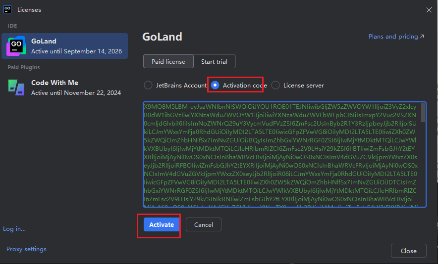  

5. 激活  
