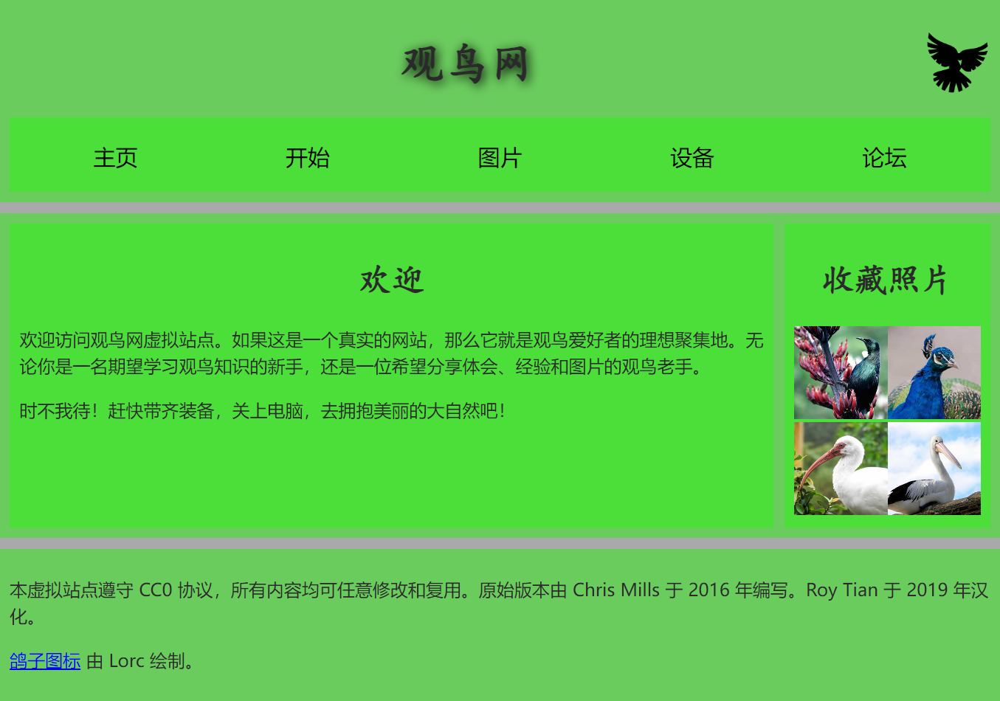
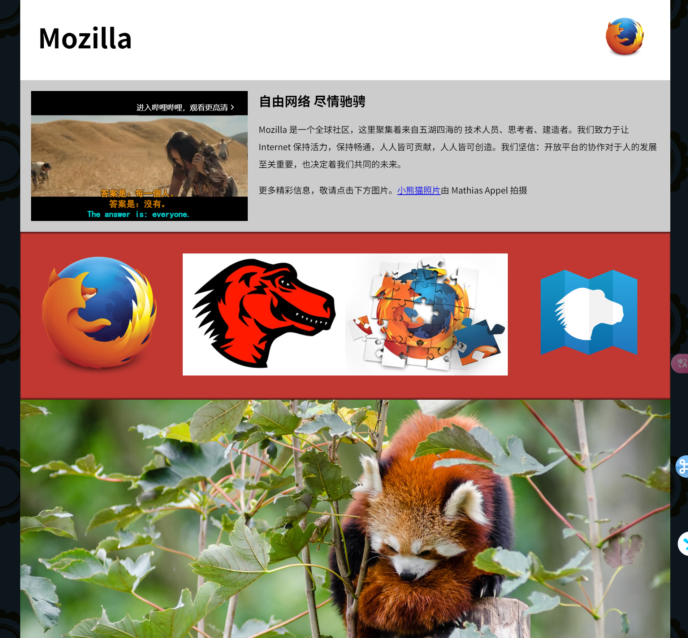
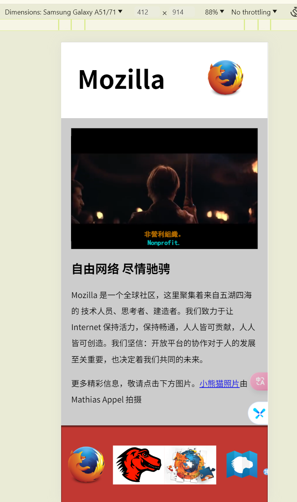
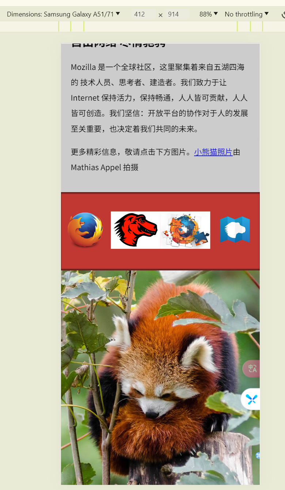

## 概述

> 前端基础-文档与网站架构

<!--more-->

## 正文

### 文档的基本组成部分  
页眉: 通常横跨于整个页面顶部有一个大标题和/或一个标志。这是网站的主要一般信息，通常存在于所有网页。

导航栏: 指向网站各个主要区段的超链接。通常用菜单按钮、链接或标签页表示。类似于标题栏，导航栏通常应在所有网页之间保持一致，否则会让用户感到疑惑，甚至无所适从。许多 web 设计人员认为导航栏是标题栏的一部分，而不是独立的组件，但这并非绝对；还有人认为，两者独立可以提供更好的无障碍访问特性，因为屏幕阅读器可以更清晰地分辨二者。

主内容: 中心的大部分区域是当前网页大多数的独有内容,例如视频、文章、地图、新闻等。这些内容是网站的一部分，且会因页面而已。 

侧边栏：一些外围信息、链接、引用、广告等。通常与主内容相关（例如一个新闻页面上，侧边栏可能包含坐着信息或相关文章链接），还可能存在其他的重复元素，如辅助导航系统。 

页脚：横跨页面底部的狭长区域。和标题一样，页脚是放置公共信息（比如版权声明或联系方式）的，一般使用较小字体，且通常为次要内容。还可以通过提供快速访问链接来进行 SEO。

### 用于构建内容的HTML
- \<header>: 页眉
- \<nav>: 导航栏  
- \<main>: 主内容。主内容中还可以有各种字内容区段,可用\<article> \<section> 和 \<div>等元素表示。
- \<aside>: 侧边栏,经常嵌套在\<main>中
- \<footer>: 页脚  

### 示例代码  
```html
<!doctype html>
<html>

<head>
    <meta charset="utf-8" />
    <title>二次元俱乐部</title>
    <link href="https://fonts.googleapis.com/css?family=Open+Sans+Condensed:300|Sonsie+One" rel="stylesheet" />
    <link href="https://fonts.googleapis.com/css?family=ZCOOL+KuaiLe" rel="stylesheet" />
    <link href="style.css" rel="stylesheet" />
</head>

<body>
    <header>
        <!-- 本站所有网页的统一主标题 -->
        <h1>聆听电子天籁之音</h1>
    </header>

    <nav>
        <!-- 本站统一的导航栏 -->
        <ul>
            <li><a href="#">主页</a></li>
            <!-- 共 n 个导航栏项目，省略…… -->
        </ul>

        <form>
            <!-- 搜索栏是站点内导航的一个非线性的方式。 -->
            <input type="search" name="q" placeholder="要搜索的内容" />
            <input type="submit" value="搜索" />
        </form>
    </nav>

    <main>
        <!-- 网页主体内容 -->
        <article>
            <!-- 此处包含一个 article（一篇文章），内容略…… -->
        </article>

        <aside>
            <!-- 侧边栏在主内容右侧 -->
            <h2>相关链接</h2>
            <ul>
                <li><a href="#">这是一个超链接</a></li>
                <!-- 侧边栏有 n 个超链接，略略略…… -->
            </ul>
        </aside>
    </main>

    <footer>
        <!-- 本站所有网页的统一页脚 -->
        <p>© 2050 某某保留所有权利</p>
    </footer>
</body>

</html>
```

### HTML布局元素细节  
>https://developer.mozilla.org/zh-CN/docs/Web/HTML/Element  

```text
<main> 存放每个页面独有的内容。每个页面上只能用一次 <main>，且直接位于 <body> 中。最好不要把它嵌套进其他元素。
<article> 包围的内容即一篇文章，与页面其他部分无关（比如一篇博文）。
<section> 与 <article> 类似，但 <section> 更适用于组织页面使其按功能（比如迷你地图、一组文章标题和摘要）分块。一般的最佳用法是：以 标题 作为开头；也可以把一篇 <article> 分成若干部分并分别置于不同的 <section> 中，也可以把一个区段 <section> 分成若干部分并分别置于不同的 <article> 中，取决于上下文。
<aside> 包含一些间接信息（术语条目、作者简介、相关链接，等等）。
<header> 是简介形式的内容。如果它是 <body> 的子元素，那么就是网站的全局页眉。如果它是 <article> 或<section> 的子元素，那么它是这些部分特有的页眉（此 <header> 非彼 标题）。
<nav> 包含页面主导航功能。其中不应包含二级链接等内容。
<footer> 包含了页面的页脚部分。
```

###  构建网页内容  
> https://developer.mozilla.org/zh-CN/docs/Learn/HTML/Introduction_to_HTML/Structuring_a_page_of_content



### Mozilla多设备兼容配置 
> https://developer.mozilla.org/zh-CN/docs/Learn/HTML/Multimedia_and_embedding/Mozilla_splash_page  
- 为 header 添加一个图标  
- 为主 article 添加一个视频  
- 为 further info 的链接添加响应式图片  
- 一张小熊猫的艺术照  

 

