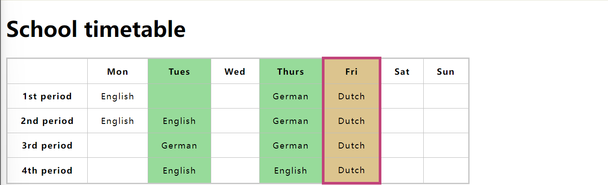
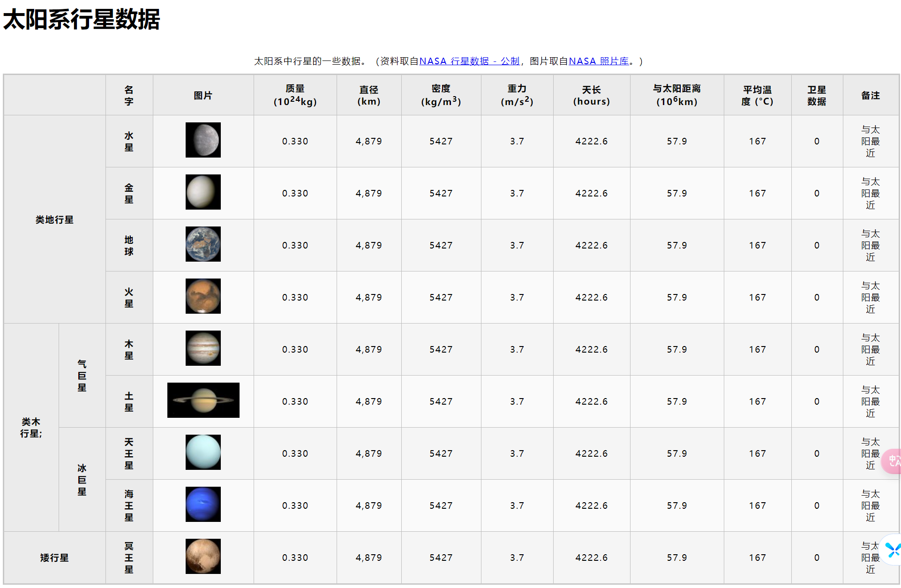

## 概述

> 前端基础-表格。

<!--more-->

## 正文

### 表格基础  
```text
分组: tr  
添加内容: td
添加标题: th

行合并: rowspan
列合并: colspan

定义整列样式: col 和 colgroup
表格增加一个标题: caption  
单元格占用多个单元格: colspan
```
#### scope属性
```html
<thead>
  <tr>
    <th scope="col">Purchase</th>
    <th scope="col">Location</th>
    <th scope="col">Date</th>
    <th scope="col">Evaluation</th>
    <th scope="col">Cost (€)</th>
  </tr>
<tr>
  <th scope="row">Haircut</th>
  <td>Hairdresser</td>
  <td>12/09</td>
  <td>Great idea</td>
  <td>30</td>
</tr>

</thead>

```
#### header  
```html
<thead>
  <tr>
    <th id="purchase">Purchase</th>
    <th id="location">Location</th>
    <th id="date">Date</th>
    <th id="evaluation">Evaluation</th>
    <th id="cost">Cost (€)</th>
  </tr>
</thead>
<tbody>
  <tr>
    <th id="haircut">Haircut</th>
    <td headers="location haircut">Hairdresser</td>
    <td headers="date haircut">12/09</td>
    <td headers="evaluation haircut">Great idea</td>
    <td headers="cost haircut">30</td>
  </tr>
</tbody>
```

```html
<!DOCTYPE html>
<html lang="en-US">

<head>
    <meta charset="utf-8">
    <meta name="viewport" content="width=device-width">
    <title>School timetable</title>
    <style>
        html {
            font-family: sans-serif;
        }

        table {
            border-collapse: collapse;
            border: 2px solid rgb(200, 200, 200);
            letter-spacing: 1px;
            font-size: 0.8rem;
        }

        td,
        th {
            border: 1px solid rgb(190, 190, 190);
            padding: 10px 20px;
        }

        td {
            text-align: center;
        }

        caption {
            padding: 10px;
        }
    </style>
</head>

<body>
    <h1>School timetable</h1>

    <table>
        <colgroup>
            <col>
            <col>
            <col style="background-color: #97DB9A;">
        </colgroup>
        <colgroup>
            <col style="width: 42px;" />
        </colgroup>

        <colgroup>
            <col style="background-color: #97DB9A;" />
        </colgroup>
        <colgroup>
            <col style="background-color:#DCC48E; border:4px solid #C1437A;">
        </colgroup>
        <colgroup>
            <col style="width: 42px;" span="2">
        </colgroup>
        <tr>
            <td>&nbsp;</td>
            <th>Mon</th>
            <th>Tues</th>
            <th>Wed</th>
            <th>Thurs</th>
            <th>Fri</th>
            <th>Sat</th>
            <th>Sun</th>
        </tr>
        <tr>
            <th>1st period</th>
            <td>English</td>
            <td>&nbsp;</td>
            <td>&nbsp;</td>
            <td>German</td>
            <td>Dutch</td>
            <td>&nbsp;</td>
            <td>&nbsp;</td>
        </tr>
        <tr>
            <th>2nd period</th>
            <td>English</td>
            <td>English</td>
            <td>&nbsp;</td>
            <td>German</td>
            <td>Dutch</td>
            <td>&nbsp;</td>
            <td>&nbsp;</td>
        </tr>
        <tr>
            <th>3rd period</th>
            <td>&nbsp;</td>
            <td>German</td>
            <td>&nbsp;</td>
            <td>German</td>
            <td>Dutch</td>
            <td>&nbsp;</td>
            <td>&nbsp;</td>
        </tr>
        <tr>
            <th>4th period</th>
            <td>&nbsp;</td>
            <td>English</td>
            <td>&nbsp;</td>
            <td>English</td>
            <td>Dutch</td>
            <td>&nbsp;</td>
            <td>&nbsp;</td>
        </tr>
    </table>


</body>

</html>
```



### 练习-构建行星数据  
>https://developer.mozilla.org/zh-CN/docs/Learn/HTML/Tables/Structuring_planet_data
  
```html
<!DOCTYPE html>
<html>

<head>
    <meta charset="utf-8">
    <title>太阳系行星数据</title>
    <link href="styles/style82.css" rel="stylesheet">
</head>

<body>
    <h1>太阳系行星数据</h1>
    <table>
        <caption>太阳系中行星的一些数据。（资料取自<a href="http://nssdc.gsfc.nasa.gov/planetary/factsheet/">NASA 行星数据 - 公制</a>，图片取自<a
                href="https://www.nasa.gov/multimedia/imagegallery/">NASA 照片库</a>。）</caption>
        <thead>
            <tr>
                <th colspan="2">&nbsp;</th>
                <th scope="col">名字</th>
                <th scope="col">图片</th>
                <th scope="col">质量 (10<sup>24</sup>kg)</th>
                <th scope="col">直径 (km)</th>
                <th scope="col">密度 (kg/m<sup>3</sup>)</th>
                <th scope="col">重力 (m/s<sup>2</sup>)</th>
                <th scope="col">天长 (hours)</th>
                <th scope="col">与太阳距离 (10<sup>6</sup>km)</th>
                <th scope="col">平均温度 (°C)</th>
                <th scope="col">卫星数据</th>
                <th scope="col">备注</th>
            </tr>

        </thead>
        <tbody>
            <tr>
                <th colspan="2" rowspan="4">类地行星</th>

                <th scope="col">水星</th>
                <td>
                    
                </td>
                <td>0.330</td>
                <td>4,879</td>
                <td>5427</td>
                <td>3.7</td>
                <td>4222.6</td>
                <td>57.9</td>
                <td>167</td>
                <td>0</td>
                <td>与太阳最近</td>

            </tr>
            <tr>
                <!-- <td colspan="2">&nbsp;</td> -->
                <th scope="col">金星</th>
                <td>
                    
                </td>
                <td>0.330</td>
                <td>4,879</td>
                <td>5427</td>
                <td>3.7</td>
                <td>4222.6</td>
                <td>57.9</td>
                <td>167</td>
                <td>0</td>
                <td>与太阳最近</td>

            </tr>
            <tr>
                <!-- <td colspan="2">&nbsp;</td> -->

                <th scope="col">地球</th>
                <td>
                    
                </td>
                <td>0.330</td>
                <td>4,879</td>
                <td>5427</td>
                <td>3.7</td>
                <td>4222.6</td>
                <td>57.9</td>
                <td>167</td>
                <td>0</td>
                <td>与太阳最近</td>

            </tr>
            <tr>
                <!-- <td colspan="2">&nbsp;</td> -->
                <th scope="col">火星</th>
                <td>
                    
                </td>
                <td>0.330</td>
                <td>4,879</td>
                <td>5427</td>
                <td>3.7</td>
                <td>4222.6</td>
                <td>57.9</td>
                <td>167</td>
                <td>0</td>
                <td>与太阳最近</td>

            </tr>
            <tr>
                <th rowspan="4">类木行星;</th>
                <th rowspan="2">气巨星</th>
                <th scope="col">木星</th>
                <td>
                    
                </td>
                <td>0.330</td>
                <td>4,879</td>
                <td>5427</td>
                <td>3.7</td>
                <td>4222.6</td>
                <td>57.9</td>
                <td>167</td>
                <td>0</td>
                <td>与太阳最近</td>

            </tr>

            <tr>
                <!-- <td>&nbsp;</td> -->
                <th scope="col">土星</th>
                <td>
                    
                </td>
                <td>0.330</td>
                <td>4,879</td>
                <td>5427</td>
                <td>3.7</td>
                <td>4222.6</td>
                <td>57.9</td>
                <td>167</td>
                <td>0</td>
                <td>与太阳最近</td>

            </tr>

            <tr>
                <!-- <td>&nbsp;</td> -->
                <th rowspan="2">冰巨星</th>
                <th scope="col">天王星</th>
                <td>
                    
                </td>
                <td>0.330</td>
                <td>4,879</td>
                <td>5427</td>
                <td>3.7</td>
                <td>4222.6</td>
                <td>57.9</td>
                <td>167</td>
                <td>0</td>
                <td>与太阳最近</td>

            </tr>

            <tr>
                <!-- <td>&nbsp;</td> -->
                <!-- <td>&nbsp;</td> -->
                <th scope="col">海王星</th>
                <td>
                    
                </td>
                <td>0.330</td>
                <td>4,879</td>
                <td>5427</td>
                <td>3.7</td>
                <td>4222.6</td>
                <td>57.9</td>
                <td>167</td>
                <td>0</td>
                <td>与太阳最近</td>

            </tr>

            <tr>
                <th colspan="2">矮行星</th>
                <!-- <td>&nbsp;</td> -->
                <th scope="col">冥王星</th>
                <td>
                    
                </td>
                <td>0.330</td>
                <td>4,879</td>
                <td>5427</td>
                <td>3.7</td>
                <td>4222.6</td>
                <td>57.9</td>
                <td>167</td>
                <td>0</td>
                <td>与太阳最近</td>

            </tr>
        </tbody>

    </table>
</body>

</html>
```
`styles/style82.css`文件
```css
html {
    font-family: sans-serif;
  }
  
  table {
    border-collapse: collapse;
    border: 2px solid rgb(200,200,200);
    letter-spacing: 1px;
    font-size: 0.8rem;
  }
  
  td, th {
    border: 1px solid rgb(190,190,190);
    padding: 10px 20px;
  }
  
  th {
    background-color: rgb(235,235,235);
  }
  
  td {
    text-align: center;
  }
  
  tr:nth-child(even) td {
    background-color: rgb(250,250,250);
  }
  
  tr:nth-child(odd) td {
    background-color: rgb(245,245,245);
  }
  
  caption {
    padding: 10px;
  }
```


  