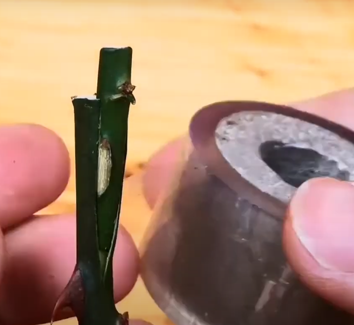
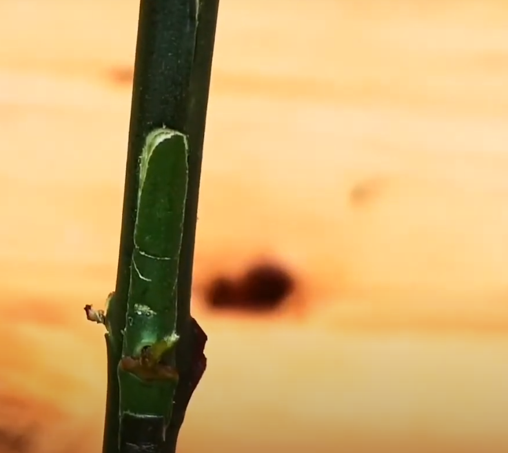
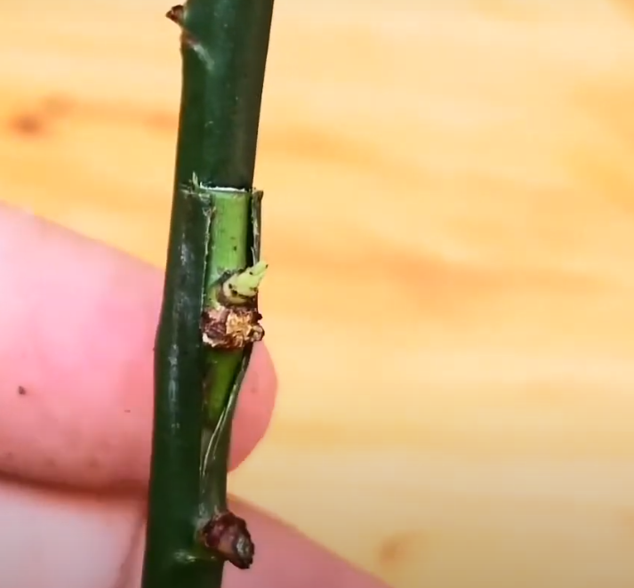
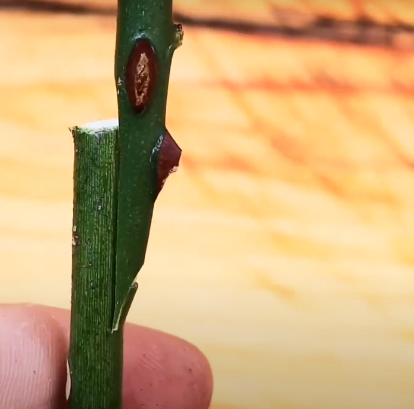

## 概述

> 常用的嫁接方法。
> https://www.youtube.com/watch?v=U2408cZHc8g  

<!--more-->

## 嫁接月季常用的四种方法  
### 插皮接  
 
###  嵌芽接  
  

###  T型芽接  

 

### 切接  

## 嫁接果树常用的方法
>https://www.youtube.com/watch?v=fvYUoK1EHD0  
>